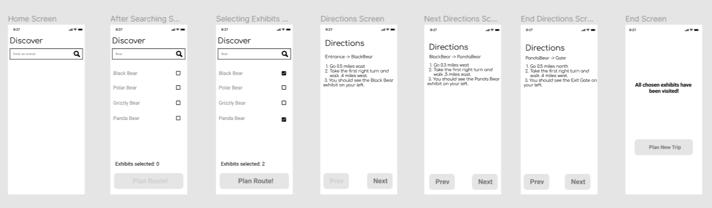

# ZooSeeker

### Description
ZooSeeker is an Android application that allows for users to plan out a day at the San Diego Zoo, complete with an optimized path through their selected exhibits.

## Project Spec

This app was made in a team of 6 with the agile methodology of Kanban over the course of April 2022 - May 2022.

## Board
Zenhub was used for project management and issue tracking. 

https://app.zenhub.com/workspaces/team-60-project-6261b2c5751169001d6551f4/board

### Features:

- **Users can search for exhibits** 
- **Users can search exhibits by category**
- **Users can see a list of exhibits that they marked to visit**
- **Users can see the total number of exhibits in their plan**
- **Users can get directions for the shortest path for the exhibits in their plan**
- **Users can advance forward in their plan**
- **Users can go backwards in their plan**
- **Users can preserve their plan**
- **Users can reset their plan**
- **Users can see a route plan summary**
- **Users can toggle between detailed and simple directions to each exhibit**
- **Users can adjust their plan**
- **Users can redirect if they deviate from their plan**
- **Users can skip exhibits**

### User Stories:

19 User Stories implemented total, each written with BDD Scenarios:

https://docs.google.com/document/d/1Im56aqYsFOYT63fitK6gazUwkZTcd8ZGiDBOlC26m0I/edit?usp=sharing

## Wireframes

### Reflections and Future Considerations:

This project was my introduction into the world of agile software development. I learned a lot amount planning out iterations, working in groups, as well as when to pivot in order to have deliverables ready for each sprint. My role varied according to the needs of our team, but I spent the most time as a project manager and lead tester for our project. These roles gave me some experience in communication as well as continuous integration and android testing frameworks like Espresso.

If I had more time, I would have spent more time on the user experience of this project. We didn't work on the user experience or user interface of this project in order to meet our mvp as well as implement all of our user stories. However, it may be a better idea to cut out less essential features and improve upon the user experience of the core features.

